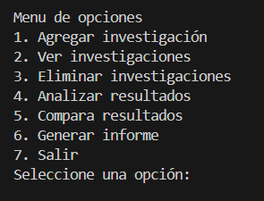

<h1>Reto_1_DevSenior </h1>

<h2> Poyecto de Investigación Cientifica en Python 🐍</h2>
<h3>Participantes: Andres Camilo Neira Pacalagua, Fabian Esteban Osorio Torres</h3>

<h2>Introduccion</h2>

Este es un proyecto creado en Python para la geestoion de de experimentos, en el cual podemos agregar, eliminar, visualizar, comparar y crear un informe en archivo .txt lo experimetos que pueden ser agredados son de tres tipos:

* Tipo 1: Química.🔬
* Tipo 2: Física. 📉
* Tipo 3: Biología.🌎

<h2> Funcionalidades </h2>

* Agregar Investigación 📝: Nos permite agregar detalles de los experimentos, como su nombre, fecha de realización, tipo y los resultados obtenidos.
* Ver investigaciones 📖: Muestra una tabla con las investigaciones registradas, donde se incluye su nombre, fecha, tipo y resultados.
* eliminar investigaciones ❌: Permite eliminar una investigación registrada previamenta, buscando esta por su nombre.
* Analisis de resultados 📄: Calcula los resultados optenidos de los experimentos y de estos saca un promedio, maximo y minimo.
* Comparador de resultados 📑: Compara los resultados de diferentes experimentos y muestra el que cuenta con una mejor desviación estandar.
* Generar informe 🖨️: Se genera un informe con toda la información de los experimentos, este informe se crea en un archivo .txt.

<h2>Requisitos </h2>

    Python 3.x
    Bibliotecas
        * tabulate (Para mostrar las tablas)
        * datetime (Para agregar fechas)
        * statistics (Para calcular estadisticas)

<h4>Para instalar las dependencias necesarias, se ejecuto el comando</h2>

    pip install tabulate

<h2>Uso</h2>

    1. Ejecutar el archivo main.py para iniciar el programa.
    2. Al iniciar el archivo main.py podemos ver el suguiente menu: 
        
    